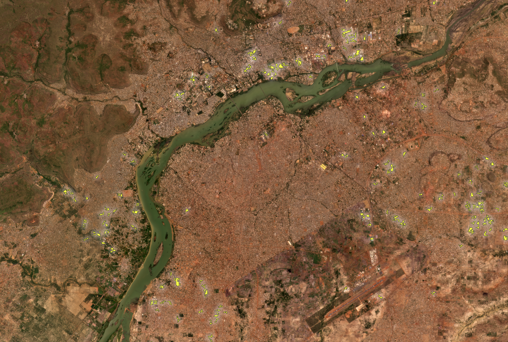

# Microsoft Building Density & Height Dataset

**Quick links:** [Paper](https://arxiv.org/abs/2511.12104) | [Web visualizer](#open-web-visualizer) | [Setup](#setup) | [Tutorial notebooks](#tutorial-notebooks) | [Datasets](#datasets) | [Model training](#model-training)

Quarterly, global estimates of **building density** and **building height** generated by running machine learning models on Planet's [quarterly PlanetScope basemaps](https://www.planet.com/products/planet-imagery/).

Specifically, we provide:
- **Global public layer (~100 m/px):** 2020 Q4 and 2023 Q4 density & height for the world, distributed as Cloud-Optimized GeoTIFFs (COGs) referenced by a **GeoPackage tile index**.
- **Five high-growth locations (public, ~40 m/px):** quarterly density & height from **2020 Q2 through 2025 Q2** (see table with direct download links below).

For questions or feedback, contact: <a href="mailto:buildings@microsoft.com"><strong>buildings@microsoft.com</strong></a>. We would love to hear from you!

## News

- **2026-05-19** – Released the global downsampled **2020 Q4** layer (~100 m/px). The tile index now exposes both quarters via per-quarter URL columns (`data_2020q4`, `data_2023q4`). The 2023 Q4 tiles have moved to a quarter-scoped path: `https://opendata.aiforgood.ai/building-density/v1/2023q4/12-39-p3_ensemble_downsampled/{filename}.tif`. Re-download `tile_index.gpkg` to pick up the new schema and URLs.
- **2025-11-12** – Initial open-source release: paper, training pipeline, tutorial notebooks, the global 2023 Q4 density & height layer, and quarterly 40 m COGs for five high-growth locations from 2020 Q2 through 2025 Q2.


<p align="center">
    <br/>
    <b>Figure 1.</b> Global building density 2023q4.
</p>


See our [visualizer](https://visualizers.aiforgood.ai/buildings/index.html) for an interactive exploration of the dataset.

<p align="center">
    <br/>
    <b>Figure 2.</b> Quarterly building density evolution for Lusaka District in Zambia.
</p>


---

## Repository Overview

This repository serves **two purposes**:

1. **Data Exploration** (main README): Access and work with our public building density & height datasets through tutorial notebooks and programmatic access.
2. **Model Training** ([TRAINING.md](TRAINING.md)): Reproduce the training pipeline from our paper to train your own model using Planet imagery.

**Most users** will be interested in the data exploration tutorials and analysis scripts detailed below. If you want to train the model yourself, see [TRAINING.md](TRAINING.md).

---

## Open web visualizer

[Click here](https://visualizers.aiforgood.ai/buildings/index.html) to explore the dataset in your browser.

## Setup

We provide a small conda environment file to help you get started with programmatic access to the dataset using Python.

```bash
conda env create -f env.yml
conda activate buildings
pip install -r requirements-data.txt
```

Download the tile index GeoPackage to the `data/` directory.
```bash
mkdir -p data/
wget -O data/planet_index.gpkg https://opendata.aiforgood.ai/building-density/tile_index.gpkg
```

## Tutorial notebooks

Two example Jupyter notebooks are included in the `tutorials/` folder to help you get started working with the data:

| Notebook | Description |
| --- | --- |
| [`building-volume-tutorial.ipynb`](tutorials/building-volume-tutorial.ipynb) | Walks through loading tiles via the GeoPackage index, computing aggregate building volume (density * height), and summarizing results for an area of interest. |
| [`working-with-temporal-raster-data.ipynb`](tutorials/working-with-temporal-raster-data.ipynb) | Shows how to identify patterns of urban growth. |

Open them in Jupyter / VS Code after creating the environment to explore typical data access and visualization workflows.

## Change detection

By comparing two temporal prediction rasters, we can begin to understand change
over time and identify areas of high growth and decline. We've included a script
to compare building change between two timestamps. This script takes prediction
rasters as input, and returns vector polygons showing areas of significant
change, or "hotspots". See: `scripts/analysis/compute-change-clusters.py`.

For each pixel and timetsamp, we compute a proxy for built volume using density
and normalized height:

```
V_t = D_t * (H_t_norm * s)
```

where:
- `D_t` = predicted density at time `t` (band 1)
- `H_t_norm` = normalized height at time `t` (band 2)
- `s` = height scale factor converting normalized height to meters
  (`height_scale_m`)

Volumetric change between two timestamps is then:

```
ΔV = V_end − V_start
```

After computing per-pixel change, we keep only those pixels with the largest
increases (positive) or decreases (negative) based on a chosen threshold (`change-percentile`). Neighboring high-change pixels are grouped into contiguous clusters and saved as polygons.

Example usage:

```
python scripts/analysis/compute-change-clusters.py
    --start-cog https://opendata.aiforgood.ai/building-density/locations/bamako/2020q2_cog.tif
    --end-cog https://opendata.aiforgood.ai/building-density/locations/bamako/2025q2_cog.tif
    --change-percentile 0.95
    --output-gpkg growth.gpkg
    --output-layer clusters
    --min-cluster-pixels 8
```
<p align="center">
    <br/>
    <b>Figure 1.</b> High growth hotspots in Bamako, 2020-2025.
</p>

## Datasets

Our data is distributed via direct download links and a tile index for programmatic access. In both cases the files are Cloud-Optimized GeoTIFFs (COGs) with two bands: building density and building height.
- **Band 1** = building density (0 to 1, fraction of pixel covered by buildings)
- **Band 2** = building height (0 to 1, multiply by 100 to get meters)
- **NoData** = −1 in both cases.

### Global data (100 m for 2020 Q4 and 2023 Q4)

We provide a **GeoPackage tile index** referencing Cloud-Optimized GeoTIFFs (COGs) for the entire world at ~100 m/px for two quarters of imagery: **2020 Q4** and **2023 Q4**. Use the index to spatially query and stream only the tiles you need: [https://opendata.aiforgood.ai/building-density/tile_index.gpkg](https://opendata.aiforgood.ai/building-density/tile_index.gpkg)

Each row in the index covers one Planet L15 quad and exposes:
- `filename` — the tile's filename (`L15-XXXXE-YYYYN.tif`), shared across both quarters.
- `data_2020q4` — direct COG URL for the 2020 Q4 layer (`https://opendata.aiforgood.ai/building-density/v1/2020q4/12-39-p3_ensemble_downsampled/{filename}.tif`).
- `data_2023q4` — direct COG URL for the 2023 Q4 layer (`https://opendata.aiforgood.ai/building-density/v1/2023q4/12-39-p3_ensemble_downsampled/{filename}.tif`).
- `tile_x`, `tile_y`, `tile_z` — Planet L15 tile coordinates.
- `geometry` — quad polygon (EPSG:3857).

---

### Quarterly high-resolution (40 m) time-series data

The higher resolution quarterly building density & height COGs for five select locations can be directly downloaded via links in the table below. The COGs follow the naming convention: `https://opendata.aiforgood.ai/building-density/locations/{location}/{quarter}_cog.tif`

Where `{location}` is one of: `bamako`, `guangdong_province`, `guatemala_department`, `lusaka_district`, `nakuru` and `{quarter}` is one of: `2020q2` through `2025q2`.

| Quarter | Bamako | Guangdong Province | Guatemala Department | Lusaka District | Nakuru |
|---|---|---|---|---|---|
| 2020q2 | [COG](https://opendata.aiforgood.ai/building-density/locations/bamako/2020q2_cog.tif) | [COG](https://opendata.aiforgood.ai/building-density/locations/guangdong_province/2020q2_cog.tif) | [COG](https://opendata.aiforgood.ai/building-density/locations/guatemala_department/2020q2_cog.tif) | [COG](https://opendata.aiforgood.ai/building-density/locations/lusaka_district/2020q2_cog.tif) | [COG](https://opendata.aiforgood.ai/building-density/locations/nakuru/2020q2_cog.tif) |
| 2020q3 | [COG](https://opendata.aiforgood.ai/building-density/locations/bamako/2020q3_cog.tif) | [COG](https://opendata.aiforgood.ai/building-density/locations/guangdong_province/2020q3_cog.tif) | [COG](https://opendata.aiforgood.ai/building-density/locations/guatemala_department/2020q3_cog.tif) | [COG](https://opendata.aiforgood.ai/building-density/locations/lusaka_district/2020q3_cog.tif) | [COG](https://opendata.aiforgood.ai/building-density/locations/nakuru/2020q3_cog.tif) |
| 2020q4 | [COG](https://opendata.aiforgood.ai/building-density/locations/bamako/2020q4_cog.tif) | [COG](https://opendata.aiforgood.ai/building-density/locations/guangdong_province/2020q4_cog.tif) | [COG](https://opendata.aiforgood.ai/building-density/locations/guatemala_department/2020q4_cog.tif) | [COG](https://opendata.aiforgood.ai/building-density/locations/lusaka_district/2020q4_cog.tif) | [COG](https://opendata.aiforgood.ai/building-density/locations/nakuru/2020q4_cog.tif) |
| 2021q1 | [COG](https://opendata.aiforgood.ai/building-density/locations/bamako/2021q1_cog.tif) | [COG](https://opendata.aiforgood.ai/building-density/locations/guangdong_province/2021q1_cog.tif) | [COG](https://opendata.aiforgood.ai/building-density/locations/guatemala_department/2021q1_cog.tif) | [COG](https://opendata.aiforgood.ai/building-density/locations/lusaka_district/2021q1_cog.tif) | [COG](https://opendata.aiforgood.ai/building-density/locations/nakuru/2021q1_cog.tif) |
| 2021q2 | [COG](https://opendata.aiforgood.ai/building-density/locations/bamako/2021q2_cog.tif) | [COG](https://opendata.aiforgood.ai/building-density/locations/guangdong_province/2021q2_cog.tif) | [COG](https://opendata.aiforgood.ai/building-density/locations/guatemala_department/2021q2_cog.tif) | [COG](https://opendata.aiforgood.ai/building-density/locations/lusaka_district/2021q2_cog.tif) | [COG](https://opendata.aiforgood.ai/building-density/locations/nakuru/2021q2_cog.tif) |
| 2021q3 | [COG](https://opendata.aiforgood.ai/building-density/locations/bamako/2021q3_cog.tif) | [COG](https://opendata.aiforgood.ai/building-density/locations/guangdong_province/2021q3_cog.tif) | [COG](https://opendata.aiforgood.ai/building-density/locations/guatemala_department/2021q3_cog.tif) | [COG](https://opendata.aiforgood.ai/building-density/locations/lusaka_district/2021q3_cog.tif) | [COG](https://opendata.aiforgood.ai/building-density/locations/nakuru/2021q3_cog.tif) |
| 2021q4 | [COG](https://opendata.aiforgood.ai/building-density/locations/bamako/2021q4_cog.tif) | [COG](https://opendata.aiforgood.ai/building-density/locations/guangdong_province/2021q4_cog.tif) | [COG](https://opendata.aiforgood.ai/building-density/locations/guatemala_department/2021q4_cog.tif) | [COG](https://opendata.aiforgood.ai/building-density/locations/lusaka_district/2021q4_cog.tif) | [COG](https://opendata.aiforgood.ai/building-density/locations/nakuru/2021q4_cog.tif) |
| 2022q1 | [COG](https://opendata.aiforgood.ai/building-density/locations/bamako/2022q1_cog.tif) | [COG](https://opendata.aiforgood.ai/building-density/locations/guangdong_province/2022q1_cog.tif) | [COG](https://opendata.aiforgood.ai/building-density/locations/guatemala_department/2022q1_cog.tif) | [COG](https://opendata.aiforgood.ai/building-density/locations/lusaka_district/2022q1_cog.tif) | [COG](https://opendata.aiforgood.ai/building-density/locations/nakuru/2022q1_cog.tif) |
| 2022q2 | [COG](https://opendata.aiforgood.ai/building-density/locations/bamako/2022q2_cog.tif) | [COG](https://opendata.aiforgood.ai/building-density/locations/guangdong_province/2022q2_cog.tif) | [COG](https://opendata.aiforgood.ai/building-density/locations/guatemala_department/2022q2_cog.tif) | [COG](https://opendata.aiforgood.ai/building-density/locations/lusaka_district/2022q2_cog.tif) | [COG](https://opendata.aiforgood.ai/building-density/locations/nakuru/2022q2_cog.tif) |
| 2022q3 | [COG](https://opendata.aiforgood.ai/building-density/locations/bamako/2022q3_cog.tif) | [COG](https://opendata.aiforgood.ai/building-density/locations/guangdong_province/2022q3_cog.tif) | [COG](https://opendata.aiforgood.ai/building-density/locations/guatemala_department/2022q3_cog.tif) | [COG](https://opendata.aiforgood.ai/building-density/locations/lusaka_district/2022q3_cog.tif) | [COG](https://opendata.aiforgood.ai/building-density/locations/nakuru/2022q3_cog.tif) |
| 2022q4 | [COG](https://opendata.aiforgood.ai/building-density/locations/bamako/2022q4_cog.tif) | [COG](https://opendata.aiforgood.ai/building-density/locations/guangdong_province/2022q4_cog.tif) | [COG](https://opendata.aiforgood.ai/building-density/locations/guatemala_department/2022q4_cog.tif) | [COG](https://opendata.aiforgood.ai/building-density/locations/lusaka_district/2022q4_cog.tif) | [COG](https://opendata.aiforgood.ai/building-density/locations/nakuru/2022q4_cog.tif) |
| 2023q1 | [COG](https://opendata.aiforgood.ai/building-density/locations/bamako/2023q1_cog.tif) | [COG](https://opendata.aiforgood.ai/building-density/locations/guangdong_province/2023q1_cog.tif) | [COG](https://opendata.aiforgood.ai/building-density/locations/guatemala_department/2023q1_cog.tif) | [COG](https://opendata.aiforgood.ai/building-density/locations/lusaka_district/2023q1_cog.tif) | [COG](https://opendata.aiforgood.ai/building-density/locations/nakuru/2023q1_cog.tif) |
| 2023q2 | [COG](https://opendata.aiforgood.ai/building-density/locations/bamako/2023q2_cog.tif) | [COG](https://opendata.aiforgood.ai/building-density/locations/guangdong_province/2023q2_cog.tif) | [COG](https://opendata.aiforgood.ai/building-density/locations/guatemala_department/2023q2_cog.tif) | [COG](https://opendata.aiforgood.ai/building-density/locations/lusaka_district/2023q2_cog.tif) | [COG](https://opendata.aiforgood.ai/building-density/locations/nakuru/2023q2_cog.tif) |
| 2023q3 | [COG](https://opendata.aiforgood.ai/building-density/locations/bamako/2023q3_cog.tif) | [COG](https://opendata.aiforgood.ai/building-density/locations/guangdong_province/2023q3_cog.tif) | [COG](https://opendata.aiforgood.ai/building-density/locations/guatemala_department/2023q3_cog.tif) | [COG](https://opendata.aiforgood.ai/building-density/locations/lusaka_district/2023q3_cog.tif) | [COG](https://opendata.aiforgood.ai/building-density/locations/nakuru/2023q3_cog.tif) |
| 2023q4 | [COG](https://opendata.aiforgood.ai/building-density/locations/bamako/2023q4_cog.tif) | [COG](https://opendata.aiforgood.ai/building-density/locations/guangdong_province/2023q4_cog.tif) | [COG](https://opendata.aiforgood.ai/building-density/locations/guatemala_department/2023q4_cog.tif) | [COG](https://opendata.aiforgood.ai/building-density/locations/lusaka_district/2023q4_cog.tif) | [COG](https://opendata.aiforgood.ai/building-density/locations/nakuru/2023q4_cog.tif) |
| 2024q1 | [COG](https://opendata.aiforgood.ai/building-density/locations/bamako/2024q1_cog.tif) | [COG](https://opendata.aiforgood.ai/building-density/locations/guangdong_province/2024q1_cog.tif) | [COG](https://opendata.aiforgood.ai/building-density/locations/guatemala_department/2024q1_cog.tif) | [COG](https://opendata.aiforgood.ai/building-density/locations/lusaka_district/2024q1_cog.tif) | [COG](https://opendata.aiforgood.ai/building-density/locations/nakuru/2024q1_cog.tif) |
| 2024q2 | [COG](https://opendata.aiforgood.ai/building-density/locations/bamako/2024q2_cog.tif) | [COG](https://opendata.aiforgood.ai/building-density/locations/guangdong_province/2024q2_cog.tif) | [COG](https://opendata.aiforgood.ai/building-density/locations/guatemala_department/2024q2_cog.tif) | [COG](https://opendata.aiforgood.ai/building-density/locations/lusaka_district/2024q2_cog.tif) | [COG](https://opendata.aiforgood.ai/building-density/locations/nakuru/2024q2_cog.tif) |
| 2024q3 | [COG](https://opendata.aiforgood.ai/building-density/locations/bamako/2024q3_cog.tif) | [COG](https://opendata.aiforgood.ai/building-density/locations/guangdong_province/2024q3_cog.tif) | [COG](https://opendata.aiforgood.ai/building-density/locations/guatemala_department/2024q3_cog.tif) | [COG](https://opendata.aiforgood.ai/building-density/locations/lusaka_district/2024q3_cog.tif) | [COG](https://opendata.aiforgood.ai/building-density/locations/nakuru/2024q3_cog.tif) |
| 2024q4 | [COG](https://opendata.aiforgood.ai/building-density/locations/bamako/2024q4_cog.tif) | [COG](https://opendata.aiforgood.ai/building-density/locations/guangdong_province/2024q4_cog.tif) | [COG](https://opendata.aiforgood.ai/building-density/locations/guatemala_department/2024q4_cog.tif) | [COG](https://opendata.aiforgood.ai/building-density/locations/lusaka_district/2024q4_cog.tif) | [COG](https://opendata.aiforgood.ai/building-density/locations/nakuru/2024q4_cog.tif) |
| 2025q1 | [COG](https://opendata.aiforgood.ai/building-density/locations/bamako/2025q1_cog.tif) | [COG](https://opendata.aiforgood.ai/building-density/locations/guangdong_province/2025q1_cog.tif) | [COG](https://opendata.aiforgood.ai/building-density/locations/guatemala_department/2025q1_cog.tif) | [COG](https://opendata.aiforgood.ai/building-density/locations/lusaka_district/2025q1_cog.tif) | [COG](https://opendata.aiforgood.ai/building-density/locations/nakuru/2025q1_cog.tif) |
| 2025q2 | [COG](https://opendata.aiforgood.ai/building-density/locations/bamako/2025q2_cog.tif) | [COG](https://opendata.aiforgood.ai/building-density/locations/guangdong_province/2025q2_cog.tif) | [COG](https://opendata.aiforgood.ai/building-density/locations/guatemala_department/2025q2_cog.tif) | [COG](https://opendata.aiforgood.ai/building-density/locations/lusaka_district/2025q2_cog.tif) | [COG](https://opendata.aiforgood.ai/building-density/locations/nakuru/2025q2_cog.tif) |

---

## Clipping to an area of interest

The global layer is distributed as thousands of Planet L15 quads, so working with a
country or region usually means finding the right quads, mosaicking them, and clipping
the result. We've included a script that does this in one step and writes a single
two-band COG. See: `scripts/analysis/clip-to-boundary.py`.

Only the tiles overlapping your area of interest are read, and they're streamed directly
over HTTP with GDAL's `/vsicurl/` driver, so nothing but the tile index is downloaded.
The output keeps the source CRS, resolution and pixel grid and is resampled with nearest
neighbour onto a grid-aligned extent, so its pixels are an exact copy of the source plus
boundary masking.

The area of interest can either be your own vector file (any OGR-readable format,
reprojected as needed) or a country ISO3 code, in which case the ADM0 boundary is
downloaded from [fieldmaps.io](https://fieldmaps.io/data/geoboundaries) automatically.

Example usage:

```
# Clip a country by ISO3 code
python scripts/analysis/clip-to-boundary.py
    --iso3 LSO
    --quarter 2023q4
    --output lesotho_2023q4.tif

# Clip to your own vector file
python scripts/analysis/clip-to-boundary.py
    --boundary aoi.gpkg
    --layer districts
    --quarter 2020q4
    --output aoi_2020q4.tif
```

Pass `--list-quarters` to see which quarters the tile index currently exposes. The
quarters are read from the index itself, so newly published layers are picked up without
updating the script.

Statistics computed near the edge of an area of interest (focal windows, zonal summaries)
will otherwise be evaluated against NoData. Use `--buffer-m` to keep a margin of real data
around the boundary:

```
python scripts/analysis/clip-to-boundary.py
    --iso3 RWA
    --quarter 2023q4
    --buffer-m 1000
    --output rwanda_2023q4.tif
```

> **Note:** the buffer is specified as a ground distance in meters. EPSG:3857 is not
> conformal with respect to the WGS84 ellipsoid, so the script scales the distance by the
> local meridian scale factor and verifies the result geodesically rather than buffering
> in projected units directly.

Because this script reads the global tile index, it covers the quarters published in that
index (currently 2020 Q4 and 2023 Q4) at roughly 76 m/px. For the five locations with a
quarterly time series, the per-quarter COGs linked above are already clipped and can be
used directly.

---

## Model Training

Want to train the model yourself? See **[TRAINING.md](TRAINING.md)** for:
- Complete training pipeline reproduction
- Data preparation (Overture priors, Google 2.5D labels)
- Training configuration
- Inference on new imagery

**Note:** Requires access to Planet imagery quarterly mosaics.

---

## Citation

Please cite our [paper](https://arxiv.org/abs/2511.12104) if you use this code or dataset:
```
@misc{microsoftbuildings,
      title={TEMPO: Global Temporal Building Density and Height Estimation from Satellite Imagery}, 
      author={Tammy Glazer and Gilles Q. Hacheme and Akram Zaytar and Luana Marotti and Amy Michaels and Girmaw Abebe Tadesse and Kevin White and Rahul Dodhia and Andrew Zolli and Inbal Becker-Reshef and Juan M. Lavista Ferres and Caleb Robinson},
      year={2025},
      eprint={2511.12104},
      archivePrefix={arXiv},
      primaryClass={cs.CV},
      url={https://arxiv.org/abs/2511.12104}, 
}
```


---

## Contributing

Contributions to this project are welcome. Please fork the repository and submit a pull request with your changes.

## License

The code in this repository is licensed under the [MIT License](LICENSE).

The building density & height dataset (all Cloud-Optimized GeoTIFFs and the GeoPackage tile index described above) is licensed under the **Community Data License Agreement (CDLA) Permissive 2.0**. You may use, modify, and redistribute the data under the terms of that license, with appropriate attribution. Full text: https://cdla.dev/permissive-2-0/